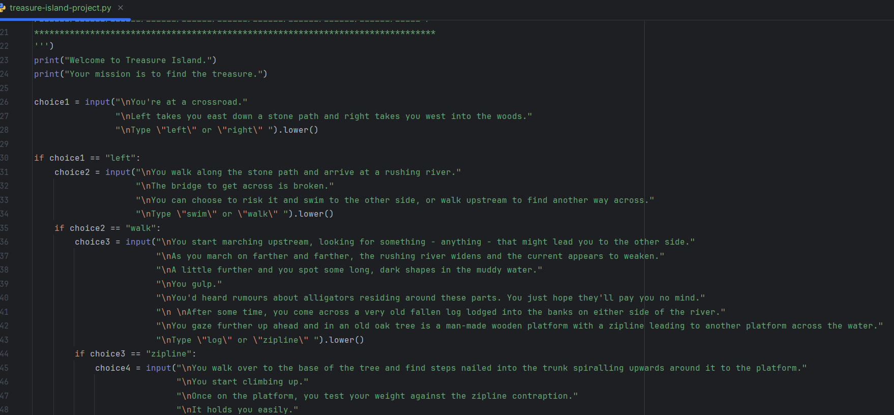
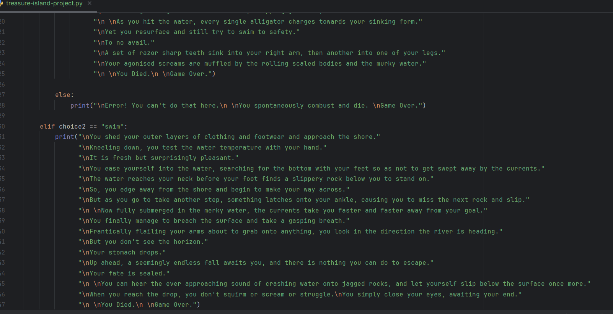

# Treasure Island Project Demo

A "choose your own adventure" game/python prototype to practice and demonstrate narrative storytelling and branching/multiple choice.

In this unfinished demo, you'll find:
- branching narrative paths
- simple interactive storytelling mechanics

The goal of this project was to experiment with narrative structure and decision-based storytelling.

To run the program:
python treasure-island-project.py
